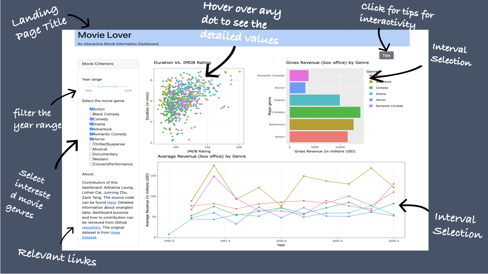

# movielover_r
To visit our deployed dashboard on **Heroku**, please visit the [link](https://dsci532-movielover-r.herokuapp.com/).

Hello!🍺  Bonjour! 🎉  Hola！👋  你好！🎆  Thanks for visiting the dashboard of movie information for movie enthusiasts!!

This document (the README file) will provide general information about the app. You can select one of the following options for a specific section!
 
* [Visualization App Purpose](#visualization-app-purpose)
* [Usage Instructions](#usage-instructions)
* [App Description](#app-description)
* [App Sketch](#app-sketch)
* [How to Install and Run Locally](#how-to-install-and-run-locally)
* [Contribution](#contribution)
* [Contributors](#contributors)

### Visualization App Purpose

Millions of movies are published on a variety of channels; however, filtering excellent movies could be time-consuming. If we could provide a list of popular movies based on customers' preferences and illustrate approximation of box offices from different dimensions, they will save a large amount of time on searching for high-quality movies. To solve this challenge, we propose building a data visualization app that allows movie enthusiasts to explore the top 10 popular movies, box offices and other relevant information. Our app can be served as a great exploratory tool for people who like visualization and friendly-user-interface to extract various data at the same time with minimum efforts to select the filters.

The full proposal can be found in [our proposal file](https://github.com/UBC-MDS/movielover_r/blob/main/docs/proposal.md).

### Usage Instructions

Users can select year range and multiple genres in the sidebar to filter out movie data to visualize in the dashboard. The dashboard contains three graphics (bar chart, line chart and scatter plot). A detailed introduction to the graphics can be found in the followed section.

Our app support interactivity between graphs. Detailed instruction as follows:
* Bar chart: Total US revenue of a movie genre will be shown by hovering over the bar. Also, users can click and drag on the plot to create a movable selection region.
* Line chart: Movie genre and the year of the data will be shown by hovering over the point on the line. Moreover, users can also select an interval to highlight a more specified period.
* Scatter plot: IMDB rating and duration of a movie will be shown by hovering over the point. Interval selection is also supported in the scatterplot to serve presentation needs.

Brief instruction of interactivity can be also found by clicking the popover button ("Tips") on the top right of the dashboard!

### App Description

`Movie Lover` is a dashboard designed to help movie enthusiasts explore various information (depending on the filter constraints) about movies, such as the US gross revenue for different movies genres (in the bar chart), the relationship between runtime and rating (in the scatter plot), as well as trends of average gross revenue by genres in selected year range (in the line chart). Users can filter out the movies' release years using the slider bar underneath the landing page's title. Underneath the slider, there is a click box, where users can select the movies genres they are interested in. The bar chart and scatter plot will be shown on the right side above the line chart. A brief introduction including relevant links to source files and contributors is positioned under the click box in the sidebar.

### App Sketch  



### How to install and run locally

#### Clone the repo and navigate to the directory

```bash
git clone https://github.com/UBC-MDS/movielover_r
```

```bash
cd movielover_r
```

#### Run the dashboard

Run the following command at the root directory of the folder:

```bash
R -f init.R
```

```bash
R -f app.R
```

The dashboard then would be available locally via <localhost:8050>, please follow the contribution section if you would like to improve our app!

### Contribution

We welcome all feedback and contributions. If you are interested in contributing to our app, please read our [contributing document](https://github.com/UBC-MDS/movielover_r/blob/main/CONTRIBUTING.md) and our [code of conduct](https://github.com/UBC-MDS/movielover_r/blob/main/CODE_OF_CONDUCT.md). Our [license](https://github.com/UBC-MDS/movielover_r/blob/main/LICENSE) outlines our permissions and copyright information for users.

### Contributors

This GitHub repository was created by Adrianne Leung, Junrong Zhu, Linhan Cai and Zack Tang.
